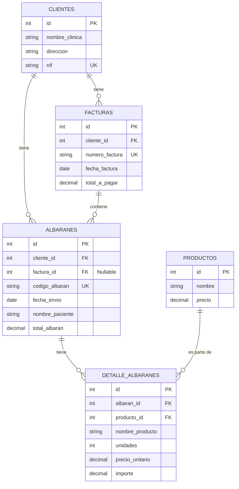

Claro, aquí tienes una propuesta completa y detallada para el `README.md` de tu proyecto "S.M. Dental", utilizando la información de los ficheros que has proporcionado.

-----

# S.M. Dental - Sistema de Facturación

> Sistema de gestión web desarrollado con Laravel para "S.M. Dental", diseñado para administrar de forma eficiente clientes, productos, y el ciclo completo de facturación desde la creación de albaranes hasta la generación de facturas finales.

Este proyecto nace de la necesidad de automatizar y organizar la gestión comercial de un laboratorio dental, permitiendo un seguimiento detallado de los trabajos enviados a las clínicas, los costes asociados y la facturación periódica.

## ✨ Características Principales

El sistema cuenta con varios módulos interconectados que cubren todo el flujo de trabajo:

  - **Gestión de Clientes (Clínicas):**

      - Crear, leer, actualizar y eliminar (CRUD) la información de las clínicas dentales.
      - Validación de datos, incluyendo NIF único para evitar duplicados.
      - Listado y vista detallada de cada cliente.

  - **Gestión de Productos:**

      - CRUD completo para los productos y servicios que ofrece el laboratorio.
      - Campos para nombre y precio.
      - Listado y vista detallada.

  - **Gestión de Albaranes:**

      - Creación de nuevos albaranes de envío asociados a un cliente y un paciente.
      - Generación de un `codigo_albaran` único basado en la fecha y el ID.
      - Adición dinámica de múltiples productos al albarán, con cálculo automático de importes.
      - Aplicación de descuentos sobre el total.
      - Edición y eliminación de albaranes **siempre que no estén facturados**.
      - Vista detallada del albarán con la información del emisor y el receptor.

  - **Generación de Facturas:**

      - Interfaz para generar facturas agrupando múltiples albaranes de un cliente en un rango de fechas específico.
      - Cálculo automático del total a pagar sumando los importes de los albaranes seleccionados.
      - Generación de un `numero_factura` único y consecutivo por día.
      - Los albaranes utilizados quedan marcados como "facturados", evitando su doble facturación.
      - Listado y vista detallada de facturas generadas, incluyendo los albaranes que la componen.

## 🛠️ Tecnologías y Herramientas

Este proyecto se ha construido utilizando un stack de tecnologías moderno y robusto:

| Tecnología | Versión/Tipo | Propósito |
| :--- | :--- | :--- |
| **PHP** | `^8.2` | Lenguaje de programación base. |
| **Laravel** | `^12.0` | Framework principal del backend. |
| **Bootstrap** | `5.3.3` | Framework CSS para el diseño de la interfaz de usuario principal. |
| **Vite** | `^6.2.4` | Herramienta de compilación y empaquetado de assets del frontend. |
| **MySQL / SQLite** | - | Sistema de gestión de bases de datos. |
| **Eloquent ORM** | - | Mapeo de objetos relacional para interactuar con la base de datos. |
| **Blade** | - | Motor de plantillas de Laravel. |

## 📊 Diagrama de la Base de Datos (E-R)

La estructura de la base de datos es el núcleo del sistema, garantizando la integridad y relación entre las distintas entidades. Las relaciones principales son:

  - Un `Cliente` puede tener muchos `Albaranes` y muchas `Facturas`.
  - Una `Factura` pertenece a un `Cliente` y puede agrupar varios `Albaranes`.
  - Un `Albaran` pertenece a un `Cliente` y, opcionalmente, a una `Factura`.
  - Un `Albaran` está compuesto por uno o más `DetalleAlbaran`.
  - Cada `DetalleAlbaran` está asociado a un `Producto`.

<!-- end list -->



## 🚀 Puesta en Marcha

Para ejecutar este proyecto en un entorno de desarrollo local, sigue estos pasos:

#### **1. Prerrequisitos**

Asegúrate de tener instalados los siguientes programas:

  * PHP 8.2 o superior
  * Composer
  * Node.js y npm
  * Un servidor de base de datos (ej. MySQL)

#### **2. Instalación**

1.  **Clonar el repositorio:**

    ```bash
    git clone https://github.com/triano83/dental.git
    cd dental
    ```

2.  **Instalar dependencias de PHP:**

    ```bash
    composer install
    ```

3.  **Instalar dependencias de Node.js:**

    ```bash
    npm install
    ```

4.  **Configurar el entorno:**
    Copia el fichero de ejemplo `.env.example` y renómbralo a `.env`.

    ```bash
    cp .env.example .env
    ```

5.  **Generar la clave de la aplicación:**

    ```bash
    php artisan key:generate
    ```

6.  **Configurar la base de datos:**
    Abre el fichero `.env` y configura las credenciales de tu base de datos:

    ```
    DB_CONNECTION=mysql
    DB_HOST=127.0.0.1
    DB_PORT=3306
    DB_DATABASE=nombre_de_tu_bd
    DB_USERNAME=tu_usuario
    DB_PASSWORD=tu_contraseña
    ```

7.  **Ejecutar las migraciones:**
    Esto creará todas las tablas en tu base de datos.

    ```bash
    php artisan migrate
    ```

8.  **Compilar los assets:**

    ```bash
    npm run dev
    ```

9.  **Iniciar el servidor de desarrollo:**

    ```bash
    php artisan serve
    ```

¡Listo\! Ahora puedes acceder a la aplicación en `http://127.0.0.1:8000`.

## 🛣️ Rutas de la Aplicación

El sistema define las siguientes rutas web para interactuar con los diferentes módulos:

| Método HTTP | URI | Nombre de la Ruta | Acción del Controlador | Descripción |
| :--- | :--- | :--- | :--- | :--- |
| **Clientes** |
| GET | `/clientes` | `clientes.index` | `ClienteController@index` | Muestra la lista de clientes. |
| GET | `/clientes/create` | `clientes.create` | `ClienteController@create` | Muestra el formulario para crear un cliente. |
| POST | `/clientes` | `clientes.store` | `ClienteController@store` | Guarda un nuevo cliente. |
| GET | `/clientes/{cliente}` | `clientes.show` | `ClienteController@show` | Muestra los detalles de un cliente. |
| GET | `/clientes/{cliente}/edit`| `clientes.edit` | `ClienteController@edit` | Muestra el formulario para editar un cliente. |
| PUT/PATCH | `/clientes/{cliente}` | `clientes.update` | `ClienteController@update` | Actualiza un cliente. |
| DELETE | `/clientes/{cliente}` | `clientes.destroy`| `ClienteController@destroy`| Elimina un cliente. |
| **Productos** |
| GET | `/productos` | `productos.index` | `ProductoController@index`| Muestra la lista de productos. |
| ... | *(Rutas CRUD similares a Clientes)* | ... | ... | ... |
| **Albaranes** |
| GET | `/albaranes` | `albaranes.index` | `AlbaranController@index` | Muestra la lista de albaranes. |
| GET | `/albaranes/create` | `albaranes.create` | `AlbaranController@create`| Formulario para crear albarán. |
| POST | `/albaranes` | `albaranes.store` | `AlbaranController@store` | Guarda un nuevo albarán. |
| GET | `/albaranes/{albaran}` | `albaranes.show` | `AlbaranController@show` | Muestra los detalles de un albarán. |
| GET | `/albaranes/{albaran}/edit`| `albaranes.edit` | `AlbaranController@edit` | Formulario para editar un albarán. |
| PUT | `/albaranes/{albaran}` | `albaranes.update` | `AlbaranController@update` | Actualiza un albarán. |
| DELETE | `/albaranes/{albaran}` | `albaranes.destroy`| `AlbaranController@destroy`| Elimina un albarán. |
| **Facturas** |
| GET | `/facturas` | `facturas.index` | `FacturaController@index` | Muestra la lista de facturas. |
| GET | `/facturas/generar-form`| `facturas.generar.form`| `FacturaController@showGenerateForm`| Muestra el formulario para generar facturas. |
| POST | `/facturas/generar` | `facturas.generar` | `FacturaController@generarFacturas` | Procesa y genera una nueva factura. |
| GET | `/facturas/{factura}` | `facturas.show` | `FacturaController@show` | Muestra los detalles de una factura. |

## 📸 Capturas de Pantalla (Ejemplos)

A continuación, se muestran algunas de las interfaces clave del sistema.

#### **Listado de Albaranes**

*Muestra todos los albaranes, su estado de facturación y las acciones rápidas.*

#### **Creación de un Nuevo Albarán**

*Formulario dinámico para añadir productos, calcular totales y aplicar descuentos en tiempo real.*

#### **Detalle de la Factura**

*Vista completa de una factura, incluyendo los datos del emisor, receptor y la lista de albaranes que la componen.*

-----

\<p align="center"\>
Este README fue generado para demostrar las capacidades del proyecto S.M. Dental.
\</p\>
