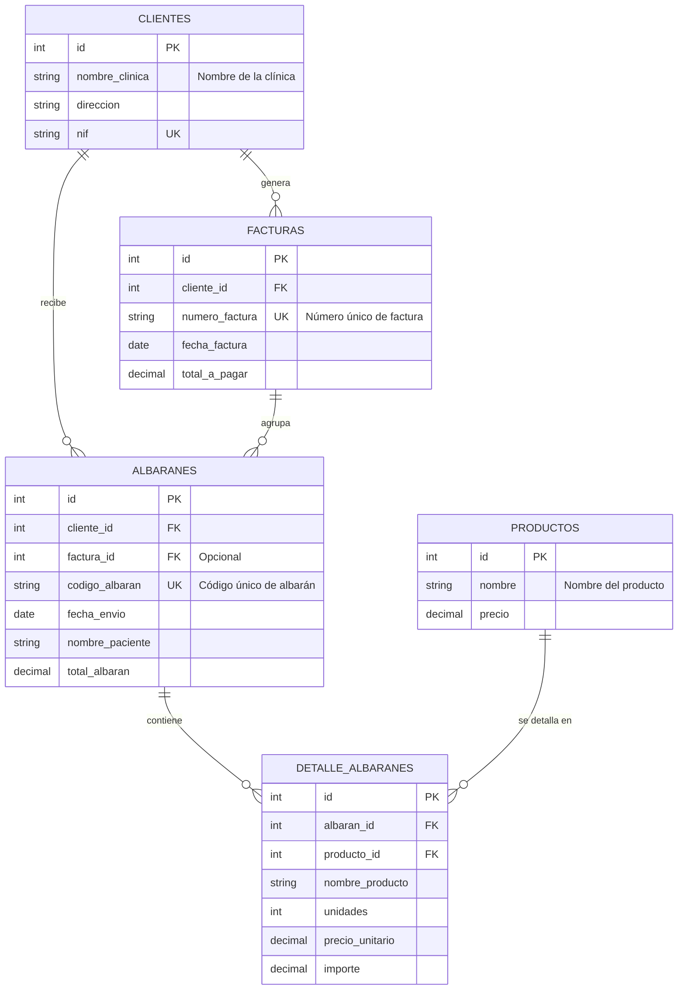

# S.M. Dental - Sistema de Facturación

> 🎨 **Slogan:** "Precisión digital para sonrisas perfectas."

\<br\>

> Sistema de gestión web desarrollado con **Laravel** para "S.M. Dental", diseñado para administrar de forma eficiente clientes, productos, y el ciclo completo de facturación desde la creación de albaranes hasta la generación de facturas finales.

Este proyecto nace de la necesidad de automatizar y organizar la gestión comercial de un laboratorio dental, permitiendo un seguimiento detallado de los trabajos enviados a las clínicas, los costes asociados y la facturación periódica.

-----

## ✨ Características Principales

El sistema cuenta con varios módulos interconectados que cubren todo el flujo de trabajo:

| Módulo | Funcionalidades Clave |
| :--- | :--- |
| 👨‍⚕️ **Gestión de Clientes** | CRUD completo para clínicas. Validación de NIF único para evitar duplicados. |
| 🦷 **Gestión de Productos** | CRUD para los servicios del laboratorio con control de precios. |
| 📝 **Gestión de Albaranes** | Creación de albaranes por cliente y paciente. Adición dinámica de productos con cálculo de importes y descuentos. Edición y anulación controlada (no se pueden modificar si ya están facturados). |
| 🧾 **Generación de Facturas** | Interfaz para facturar múltiples albaranes por cliente y rango de fechas. Numeración de facturas automática y consecutiva. |

-----

## 🛠️ Tecnologías y Herramientas

Este proyecto se ha construido utilizando un stack de tecnologías moderno y robusto:

| Tecnología | Versión/Tipo | Propósito |
| :--- | :--- | :--- |
| **PHP** | `^8.2` | Lenguaje de programación base. |
| **Laravel** | `^12.0` | Framework principal del backend. |
| **Bootstrap** | `5.3.3` | Framework CSS para el diseño de la interfaz de usuario. |
| **Vite** | `^6.2.4` | Herramienta de compilación y empaquetado de assets del frontend. |
| **MySQL / SQLite** | - | Sistema de gestión de bases de datos. |
| **Eloquent ORM** | - | Mapeo de objetos relacional para interactuar con la base de datos. |
| **Blade** | - | Motor de plantillas de Laravel. |

-----

## 📊 Diagrama de la Base de Datos (E-R)

La estructura de la base de datos es el núcleo del sistema, garantizando la integridad y relación entre las distintas entidades.

\<div style="background-color: \#f8f9fa; padding: 20px; border-radius: 8px;"\>



\</div\>

-----

## 🚀 Puesta en Marcha

Para ejecutar este proyecto en un entorno de desarrollo local, sigue estos pasos:

#### **1. Prerrequisitos**

Asegúrate de tener instalados los siguientes programas:

  * PHP 8.2 o superior
  * Composer
  * Node.js y npm
  * Un servidor de base de datos (ej. MySQL)

#### **2. Instalación**

1.  **Clonar el repositorio:**

    ```bash
    git clone https://github.com/triano83/dental.git
    cd dental
    ```

2.  **Instalar dependencias de PHP:**

    ```bash
    composer install
    ```

3.  **Instalar dependencias de Node.js:**

    ```bash
    npm install
    ```

4.  **Configurar el entorno:**
    Copia el fichero de ejemplo `.env.example` y renómbralo a `.env`. (Nota: `.env.example` no fue proporcionado, se asume su existencia como práctica estándar de Laravel).

    ```bash
    cp .env.example .env
    ```

5.  **Generar la clave de la aplicación:**

    ```bash
    php artisan key:generate
    ```

6.  **Configurar la base de datos:**
    Abre el fichero `.env` y configura las credenciales de tu base de datos:

    ```
    DB_CONNECTION=mysql
    DB_HOST=127.0.0.1
    DB_PORT=3306
    DB_DATABASE=sm_dental_db
    DB_USERNAME=root
    DB_PASSWORD=
    ```

7.  **Ejecutar las migraciones:**
    Esto creará todas las tablas en tu base de datos.

    ```bash
    php artisan migrate
    ```

8.  **Compilar los assets:**

    ```bash
    npm run dev
    ```

9.  **Iniciar el servidor de desarrollo:**

    ```bash
    php artisan serve
    ```

¡Listo\! Ahora puedes acceder a la aplicación en `http://127.0.0.1:8000`.

-----

## 🛣️ Rutas de la Aplicación

El sistema define las siguientes rutas web para interactuar con los diferentes módulos:

| Método HTTP | URI | Nombre de la Ruta | Acción del Controlador | Descripción |
| :--- | :--- | :--- | :--- | :--- |
| **Clientes** |
| `GET` | `/clientes` | `clientes.index` | `ClienteController@index` | 🟢 Muestra la lista de clientes. |
| `GET` | `/clientes/create` | `clientes.create` | `ClienteController@create` | 🟢 Muestra el formulario para crear un cliente. |
| `POST` | `/clientes` | `clientes.store` | `ClienteController@store` | 🔵 Guarda un nuevo cliente. |
| `GET` | `/clientes/{cliente}` | `clientes.show` | `ClienteController@show` | 🟢 Muestra los detalles de un cliente. |
| `GET` | `/clientes/{cliente}/edit`| `clientes.edit` | `ClienteController@edit` | 🟡 Muestra el formulario para editar un cliente. |
| `PUT/PATCH` | `/clientes/{cliente}` | `clientes.update` | `ClienteController@update` | 🔵 Actualiza un cliente. |
| `DELETE` | `/clientes/{cliente}` | `clientes.destroy`| `ClienteController@destroy`| 🔴 Elimina un cliente. |
| **Productos** |
| `GET` | `/productos` | `productos.index` | `ProductoController@index`| 🟢 Muestra la lista de productos. |
| ... | *(Rutas CRUD similares)* | ... | ... | ... |
| **Albaranes** |
| `GET` | `/albaranes` | `albaranes.index` | `AlbaranController@index` | 🟢 Muestra la lista de albaranes. |
| `GET` | `/albaranes/create` | `albaranes.create` | `AlbaranController@create`| 🟢 Formulario para crear albarán. |
| `DELETE` | `/albaranes/{albaran}` | `albaranes.destroy`| `AlbaranController@destroy`| 🔴 Elimina un albarán. |
| **Facturas** |
| `GET` | `/facturas/generar-form`| `facturas.generar.form`| `FacturaController@showGenerateForm`| 🟢 Muestra el formulario para generar facturas. |
| `POST` | `/facturas/generar` | `facturas.generar` | `FacturaController@generarFacturas` | 🔵 Procesa y genera una nueva factura. |
| `GET` | `/facturas/{factura}` | `facturas.show` | `FacturaController@show` | 🟢 Muestra los detalles de una factura. |

-----


\<p align="center" style="color: \#6c757d;"\>
Este README fue generado para demostrar las capacidades del proyecto S.M. Dental.
\</p\>
